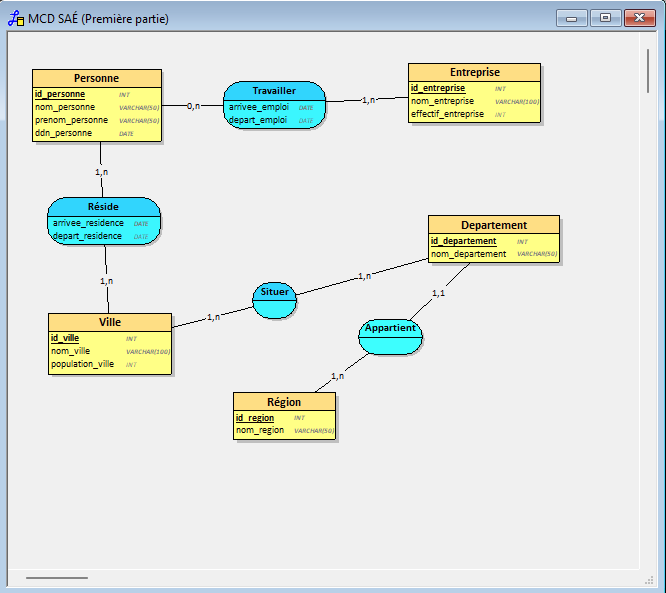
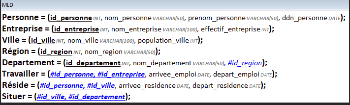

# Compétence 4 - Gérer des données de l’information

## En définissant et exploitant une base de données adaptée aux besoins

### Projet SAé 2.04 - Mission 1 : Analyse et conception d’une base de données

Dans le cadre `<du projet du projet SAé 2.04>`, j'ai travaillé sur `<la tâche d’analyse et de conception d’une base de données>`.
Ma contribution dans cette tâche peut être observée `<dans le dictionnaire de données, le graphe des dépendances fonctionnelles, le MCD et le MLD que nous avons réalisés en groupe>`.

```` text
Propriété Code Type Contraintes

Identifiant personne id_personne INT Primary Key, auto-
increment,id_personne >= 0 et
!= null

Nom de la personne nom_personne VARCHAR(50) nom_personne != null
Prénom de la personne prenom_personne VARCHAR(50) prenom_personne !=null

Date de naissance ddn_personne Date ddn_personne!= null

Identifiant entreprise id_entreprise INT Primary Key, auto-
increment,id_personne >= 0 et != null

Nom de l’entreprise nom_entreprise VARCHAR(100) nom_entreprise != null
Effectif de l’entreprise effectif_entreprise INT effectif_entreprise >=0
Date d'arrivée emploi arrivee_emploi Date arrivee_emploi != null
Date de départ emploi depart_emploi Date Peut être null

Identifiant de la ville id_ville INT Primary Key, auto-
increment,id_ville >= 0 et != null

Nom de la ville nom_ville VARCHAR(100) nom_ville != null
Population de la ville population_ville INT population_ville >=0
Date d'arrivée résidence arrivee_residence Date arrivee_residence !=null

Date de départ résidence depart_residence Date Peut être null

Identifiant du département id_departement INT Primary Key
Nom du département nom_departement VARCHAR(50) nom_departement !=null

Identifiant de la région id_region INT PRIMARY KEY
Nom de la région nom_region VARCHAR(50) nom_region != null
````

Capture d'écran du MCD :


Capture d'écran du MLD :


Cette tâche m'a permis de *définir et exploiter une base de données adaptée
aux besoins* car `j’ai analysé les données fournies, conçu le dictionnaire de données, identifié les dépendances fonctionnelles et modélisé la base à travers le MCD et le MLD afin de structurer efficacement les informations`.

## En assurant la cohérence et la qualité

### Projet SAé 2.04 - Mission 2 : Création et exploitation d’une base de données

Dans le cadre `<du projet SAé 2.04>`, j'ai travaillé sur `<la tâche de création, d’insertion et d’interrogation d’une base de données SQL>`.
Ma contribution dans cette tâche peut être observée `<dans les fichiers tables.sql, data.sql, queries.sql, stats.sql et functions.sql que nous avons produits.>`.

````sql

\o
SET client_encoding = 'LATIN1';

SET client_min_messages TO warning;
-- Pour s'arrêter lorsqu'il y a une première erreur
\set ON_ERROR_STOP on

-- Affichage de la valeur null avec la chaîne de caractères 'NULL'
\pset null 'NULL'
\echo

\echo '=====> Suppression et création du schema'

-- Suppression et création du schéma
DROP SCHEMA IF EXISTS SAE CASCADE;
CREATE SCHEMA SAE;
SET search_path TO SAE;

DROP TABLE IF EXISTS PERSONNE;
DROP TABLE IF EXISTS HABITER;
DROP TABLE IF EXISTS VILLE;
DROP TABLE IF EXISTS DEPARTEMENT;
DROP TABLE IF EXISTS REGION;
DROP TABLE IF EXISTS TRAVAILLER;
DROP TABLE IF EXISTS ENTREPRISE;


Create table REGION (
	id_region serial Unique CHECK(id_region>0),
	nom_region VARCHAR(100) NOT NULL CHECK(LENGTH(nom_region)>0),
	Primary key(id_region)
);


Create table DEPARTEMENT (
	id_departement serial UNIQUE CHECK(id_departement > 0),
	nom_departement VARCHAR(100) NOT NULL CHECK(LENGTH(nom_departement)>0),
	id_region int references REGION(id_region),
	Primary key(id_departement)
); 


Create Table VILLE (
	id_ville serial UNIQUE NOT NULL CHECK(id_ville > 0)
	nom_ville VARCHAR(100) NOT NULL CHECK(LENGTH(nom_ville) > 0),
	population_ville int NOT NULL CHECK(population_ville > 0),
	id_departement int references DEPARTEMENT(id_departement),
	Primary key(id_ville)
);

CREATE TABLE PERSONNE (
    id_personne serial UNIQUE CHECK(id_personne > 0),
    nom_personne VARCHAR(50) NOT NULL CHECK(LENGTH(nom_personne) > 0),
    prenom_personne VARCHAR(50) NOT NULL CHECK(LENGTH(prenom_personne) > 0), 
    ddn_personne date NOT NULL CHECK(ddn_personne > 1900),--fix year
    genre_personne VARCHAR(50) NOT NULL CHECK(genre_personne IN ('M','Mme')),
    id_ville int NOT NULL references VILLE(id_ville),
    PRIMARY KEY(id_personne)
);


Create TABLE HABITER (
	id_habiter serial UNIQUE CHECK(id_habiter>0),
	personne_id int references PERSONNE(id_personne),
	ville_id int references VILLE(id_ville),
	debut date NOT Null Check(debut <= Current_Date), --#fix
	arrive date Check(arrive >= debut),
	Primary key(id_habiter)
);

Create TABLE ENTREPRISE (
	id_entreprise serial UNIQUE CHECK(id_entreprise>0),
	nom_entreprise VARCHAR(100) NOT NULL CHECK(LENGTH(nom_entreprise)>0),
	effectif int NOT NULL CHECK(effectif>0),
	Primary key(id_entreprise)
);

Create TABLE TRAVAILLER (
	id_travailler serial UNIQUE CHECK(id_travailler>0),
	personne_id int references PERSONNE(id_personne),
	entreprise_id int references ENTREPRISE(id_entreprise),
	debut date NOT NULL CHECK(debut <= Current_date ), -- fix
	arrive Date Check (arrive >= debut),
	Primary key(id_travailler)
);
````


Cette tâche m'a permis d'*assurer la cohérence et la qualité* car
`<justification JJJJJ>`.

## Projet PPPPP - En assurant la protection des données

### Projet SAé 2.04 - Mission 2 : Fonctions PL/SQL

Dans le cadre `<du projet SAé 2.04>`, j'ai travaillé sur `<la tâche de création de fonctions PL/SQL pour la gestion des ajouts et modifications dans la table travailler>`.
Ma contribution dans cette tâche peut être observée `<dans le fichier functions.sql contenant les fonctions f4 et f5 ainsi que les exemples d’utilisation.>`.

```sql
-- 1
CREATE OR REPLACE FUNCTION f1(nom TEXT) RETURNS INT AS $$
SELECT COUNT(*) FROM VILLE v
JOIN DEPARTEMENT d ON v.id_departement = d.id_departement
JOIN REGION r ON d.id_region = r.id_region
WHERE r.nom_region = nom;
$$ LANGUAGE SQL;

-- 2
SELECT r.nom_region, f1(r.nom_region) AS nb_villes FROM REGION r;

-- 3
SELECT r.nom_region
FROM REGION r
ORDER BY f1(r.nom_region) DESC
LIMIT 1;

-- 4
CREATE OR REPLACE FUNCTION f2(pid INT) RETURNS TEXT AS $$
SELECT e.nom_entreprise
FROM TRAVAILLER t
JOIN ENTREPRISE e ON t.entreprise_id = e.id_entreprise
WHERE t.personne_id = pid
ORDER BY COALESCE(t.arrive, CURRENT_DATE) DESC
LIMIT 1;
$$ LANGUAGE SQL;

-- 5
SELECT nom_personne, prenom_personne, f2(id_personne)
FROM PERSONNE
ORDER BY ddn_personne DESC, nom_personne
LIMIT 10;

-- 6
SELECT * FROM PERSONNE
WHERE f2(id_personne) = 'Loiseau';

-- 7
CREATE OR REPLACE FUNCTION f3(genre TEXT)
RETURNS SETOF PERSONNE AS $$
SELECT * FROM PERSONNE WHERE genre_personne = genre;
$$ LANGUAGE SQL;

-- 8
SELECT * FROM f3('F') ORDER BY id_personne LIMIT 10;

-- 9
SELECT * FROM f3('M')
WHERE AGE(CURRENT_DATE, ddn_personne) > INTERVAL '25 years'
ORDER BY AGE(CURRENT_DATE, ddn_personne) ASC
LIMIT 10;

-- f4 et f5 (PL/pgSQL) à générer si tu confirmes que tu utilises PostgreSQL

-- f4 : ajout d'un contrat de travail si tout est cohérent
CREATE OR REPLACE FUNCTION f4(
    pid INT,
    eid INT,
    d_debut DATE,
    d_fin DATE
)
RETURNS TRAVAILLER AS $$
DECLARE
    conflit INT;
    result TRAVAILLER;
BEGIN
    -- Vérifie que la personne existe
    IF NOT EXISTS (SELECT 1 FROM PERSONNE WHERE id_personne = pid) THEN
        RETURN NULL;
    END IF;

    -- Vérifie que l'entreprise existe
    IF NOT EXISTS (SELECT 1 FROM ENTREPRISE WHERE id_entreprise = eid) THEN
        RETURN NULL;
    END IF;

    -- Vérifie que les dates sont cohérentes
    IF d_fin IS NOT NULL AND d_fin < d_debut THEN
        RETURN NULL;
    END IF;

    -- Vérifie qu'aucun autre contrat n'existe aux mêmes dates
    SELECT COUNT(*) INTO conflit
    FROM TRAVAILLER
    WHERE personne_id = pid
      AND (
            (d_fin IS NULL AND debut <= COALESCE(arrive, CURRENT_DATE)) OR
            (debut <= COALESCE(d_fin, CURRENT_DATE) AND COALESCE(arrive, CURRENT_DATE) >= d_debut)
      );

    IF conflit > 0 THEN
        RETURN NULL;
    END IF;

    -- Insertion du contrat
    INSERT INTO TRAVAILLER(personne_id, entreprise_id, debut, arrive)
    VALUES (pid, eid, d_debut, d_fin)
    RETURNING * INTO result;

    RETURN result;
END;
$$ LANGUAGE plpgsql;

```

Cette tâche m'a permis d'*assurer la protection des données* car `<j’ai mis en place des vérifications pour empêcher l’insertion ou la modification de données incohérentes et j’ai validé la cohérence des dates et des relations entre les entités, ce qui garantit l’intégrité de la base>`.

## En utilisant les mathématiques

### Projet SAé 2.04 - Mission 2 : Statistiques sur la base de données

Dans le cadre `<du projet SAé 2.04>`, j'ai travaillé sur `<la tâche de calcul de statistiques sur la base de données>`.
Ma contribution dans cette tâche peut être observée `<dans le fichier stats.sql où j’ai calculé des totaux, des moyennes, des minimums et des maximums à partir des données de la base>`.

```sql
-- 1
CREATE TABLE stat_region (
    nom_region VARCHAR(100),
    nb_personnes INT,
    total_jours INT,
    jours_moyen NUMERIC
);

-- 2
INSERT INTO stat_region
SELECT r.nom_region,
       COUNT(DISTINCT h.personne_id),
       SUM(COALESCE(arrive, CURRENT_DATE) - debut),
       AVG(COALESCE(arrive, CURRENT_DATE) - debut)
FROM REGION r
JOIN DEPARTEMENT d ON r.id_region = d.id_region
JOIN VILLE v ON d.id_departement = v.id_departement
JOIN HABITER h ON v.id_ville = h.ville_id
GROUP BY r.nom_region;

-- 3
SELECT nom_region
FROM stat_region
ORDER BY total_jours DESC
LIMIT 1;

-- 4
CREATE TABLE stat_personne (
    id_personne INT,
    nom_personne VARCHAR(50),
    prenom_personne VARCHAR(50),
    nb_contrats INT,
    nb_entreprises INT,
    duree_moyenne NUMERIC,
    duree_min INT,
    duree_max INT
);

-- 5
INSERT INTO stat_personne
SELECT p.id_personne, p.nom_personne, p.prenom_personne,
       COUNT(t.*),
       COUNT(DISTINCT t.entreprise_id),
       AVG(COALESCE(arrive, CURRENT_DATE) - debut),
       MIN(COALESCE(arrive, CURRENT_DATE) - debut),
       MAX(COALESCE(arrive, CURRENT_DATE) - debut)
FROM PERSONNE p
JOIN TRAVAILLER t ON p.id_personne = t.personne_id
GROUP BY p.id_personne, p.nom_personne, p.prenom_personne;

-- 6
SELECT * FROM stat_personne
WHERE nb_contrats <> nb_entreprises;

```

Cette tâche m'a permis d'*utiliser les mathématiques* car
`< j’ai effectué des calculs de sommes, de moyennes et de durées sur des jeux de données, notamment pour les statistiques régionales et personnelles, ce qui a nécessité des compétences en manipulation de données numériques et en agrégation SQL.>`.
