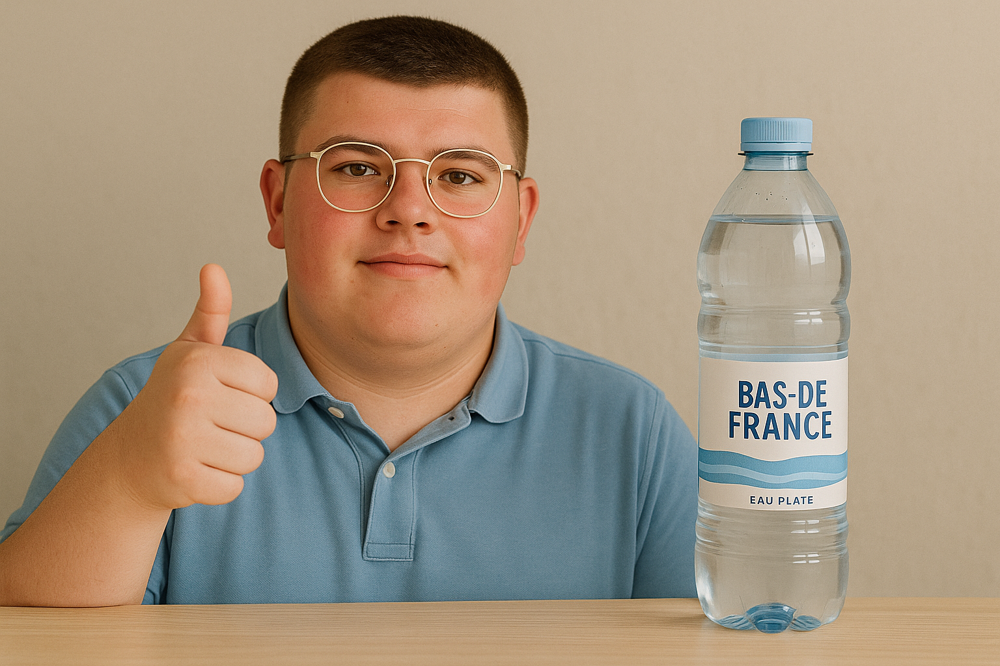
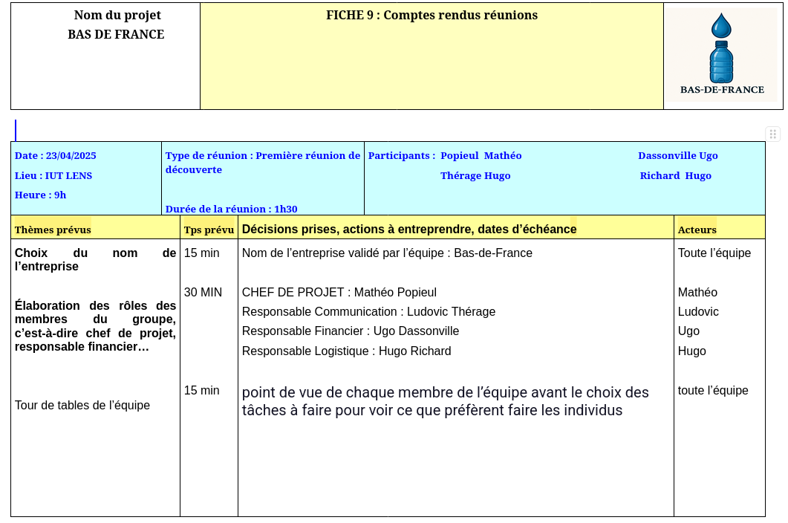
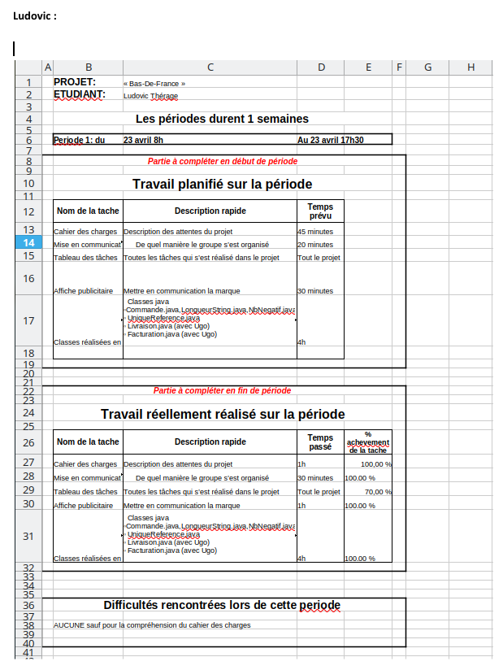
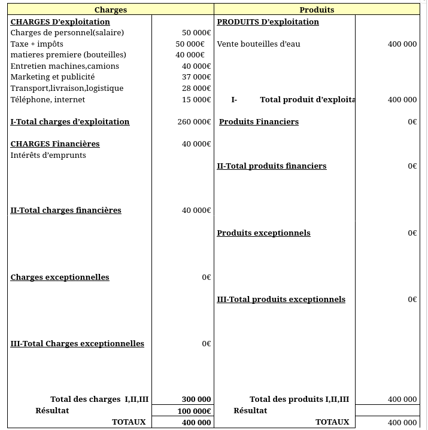

# Compétence 5 - Conduire un projet

## En adoptant une démarche proactive, créative et critique

### Projet : Ouverture de l'entreprise O-De-France dans le Sud-Est - Tâche : Élaboration de la stratégie de communication

Dans le cadre `<du projet d’ouverture de l’entreprise O-De-France dans le Sud-Est>`, j'ai travaillé sur `<création du plan de communication et la définition de l’image de marque>`.
Ma contribution dans cette tâche peut être observée `<dans le flyer que j’ai créé ainsi que dans le plan de communication détaillé>`.

image du flyer : 

Cette tâche m'a permis d'*adopter une démarche proactive, créative et critique*
car `<j'ai proposé des idées originales adaptées à la clientèle locale, créé un slogan percutant et sélectionné des supports de communication innovants. J’ai également pris du recul sur mes propositions en analysant leur pertinence et leur impact potentiel.>`.

## En communiquant efficacement avec les différents acteurs d'un projet

### Projet : Ouverture de l'entreprise O-De-France dans le Sud-Est - Tâche : Suivi de projet et organisation des réunions

Dans le cadre `<du projet d’ouverture de l’entreprise O-De-France dans le Sud-Est>`, j'ai travaillé sur `<la communication entre les membres de l'équipe et avec les encadrants via les comptes rendus de réunion et les bilans hebdomadaires.>`.
Ma contribution dans cette tâche peut être observée `<dans les comptes rendus de réunion et les bilans de suivi du projet.>`.

image du compte rendu de réunion : 

image du bilan hebdomadaire : 

Cette tâche m'a permis de *communiquer efficacement avec les différents acteurs
d'un projet* car `<j’ai assuré la transmission d’informations claires et régulières, j’ai participé activement aux échanges en réunion, et j’ai facilité la coordination entre les différents membres de l’équipe.>`.

## En respectant les règles juridiques et les normes en vigueur

### Projet : Ouverture de l'entreprise O-De-France dans le Sud-Est - Tâche : Analyse des besoins matériels et financiers

Dans le cadre `<du projet d’ouverture de l’entreprise O-De-France dans le Sud-Est>`, j'ai travaillé sur `<l’évaluation des besoins matériels et la gestion financière du projet en respectant les règles budgétaires et comptables.>`.
Ma contribution dans cette tâche peut être observée `<dans le compte de résultat et le bilan prévisionnel que j’ai complétés.>`.

image du compte de résultat : 

Cette tâche m'a permis de *respecter les règles juridiques et les normes en
vigueur* car `<j’ai veillé à respecter les normes de présentation comptable et à prendre en compte les règles de financement imposées (capital de 500 000 € et emprunt de 500 000 €). J'ai aussi intégré les obligations légales en matière de gestion d’entreprise.>`.
