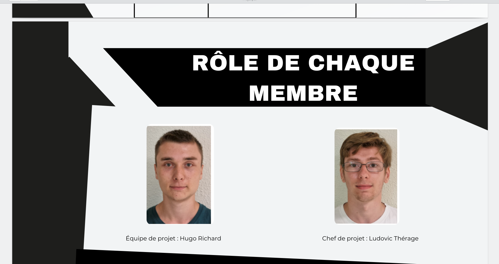
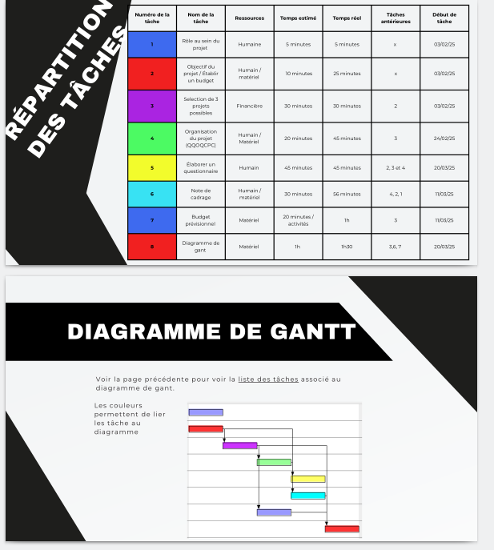
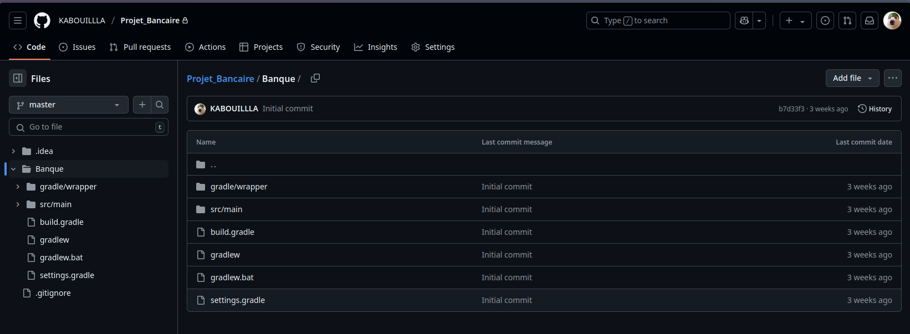
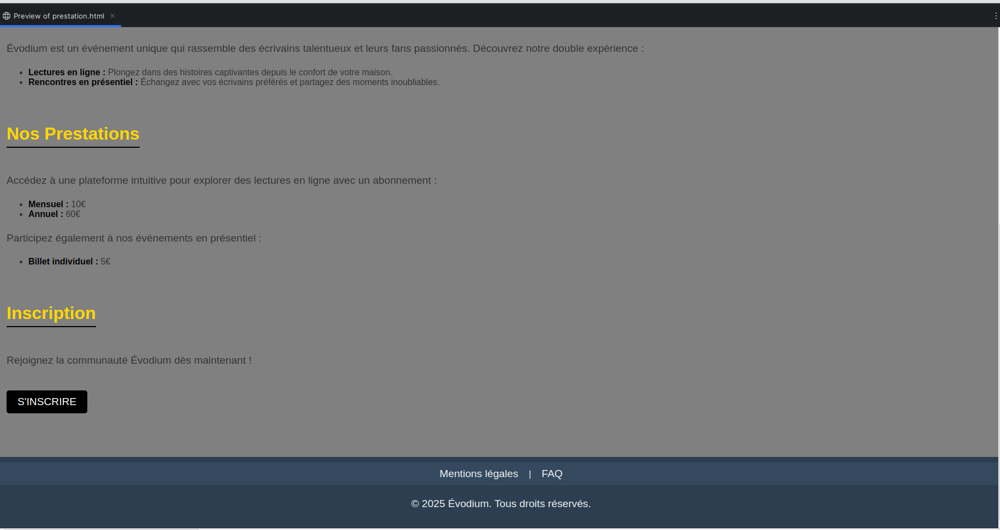

# Compétence 6 - Collaborer au sein d’une équipe informatique

## En attribuant des rôles aux membres de son équipe

### Projet d’intégration - Répartition des responsabilités

Dans le cadre `<du projet d’intégration>`, j'ai travaillé sur `<la répartition des tâches au sein de l’équipe>`.
Ma contribution dans cette tâche peut être observée `<la page 9 du pdf ci-joint>`.

image de la page 9 : 

Cette tâche m'a permis d'*attribuer des rôles aux membres de mon équipe* car
`<j'ai eu l'occasion d'être chef de projet à ce moment précis>.

## En utilisant des outils facilitant la communication et le travail collaboratif

### Projet d’intégration - Organisation et suivi d’équipe grâce à GanttProject 

Dans le cadre `<du projet d'intégration>`, j'ai travaillé sur `<la tâche de planification des tâches>`.
Ma contribution dans cette tâche peut être observée `<dans la page 19 du pdf ci-dessous>`.

image de la page 19 : 

Cette tâche m'a permis d'*utiliser des outils facilitant la communication et
le travail collaboratif* car `< cela a permis d’améliorer la réactivité de l’équipe tout au long du projet>`.

### Projet bancaire - Utilisation de GitHub pour le suivi de projet

## En utilisant des technologies de dernière génération

Dans le cadre `<du projet bancaire>`, j'ai travaillé sur `<la tâche de dépôt de documents>`.
Ma contribution dans cette tâche peut être observée `<par mon dépôt ci-joint>`.

image du dépôt : 

Cette tâche m'a permis d'*utiliser des technologies de dernière génération*
car `<j'ai appris en extra-scolaire en plus de mes ressources scolaires à utiliser Git de la meilleur façon possible et à me familiariser avec celui-ci >`.

## En veillant au respect des contraintes juridiques

### Projet site événementiel - Respect des contraintes juridiques

Dans le cadre `<du projet site événementiel>`, j'ai travaillé sur `<la tâche des mentions légales et la supressions de données>`.
Ma contribution dans cette tâche peut être observée `<la capture d'écran de la page web>`.

image de la page web : 

Cette tâche m'a permis de *veiller au respect des contraintes juridiques* car
`<j'ai appliqué les exigences du RGPD: information des utilisateurs sur leurs droits et possibilité effective de suppression de leurs données à leur demande.>`.
